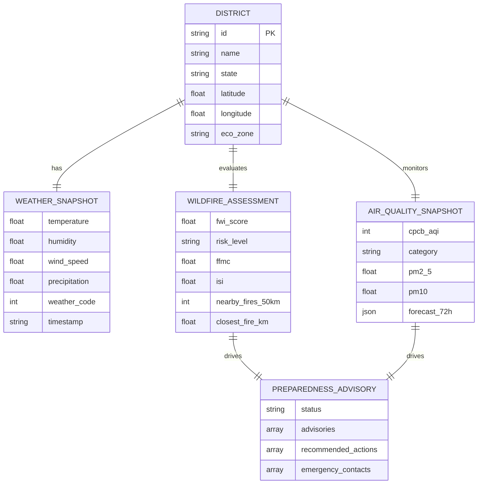

# Product Requirements Document (PRD)

## AI-Driven Wildfire Risk Assessment, Air Quality Monitoring, and Community Preparedness Platform (India)

---

## 1. Executive Summary & Problem Framing

### 1.1 Context & Problem Statement
India faces acute, overlapping environmental crises: recurring forest fire seasons across Uttarakhand, Himachal Pradesh, Odisha, Madhya Pradesh, and the Western Ghats, accompanied by severe, life-threatening air quality degradation across the Indo-Gangetic Plain and urban centers. Critical environmental risk intelligence is severely fragmented across siloed portals (Forest Survey of India, Central Pollution Control Board, and India Meteorological Department). Common citizens, researchers, and local disaster response teams lack a unified, real-time dashboard that correlates active wildfires with downstream air quality spikes and translates complex meteorological data into actionable community safety advisories.

### 1.2 Proposed Product Vision
A zero-cost, high-performance, web-based platform tailored for Indian regions. It fuses near-real-time satellite fire observations (NASA FIRMS VIIRS 375m), live weather physics (Canadian Forest Fire Weather Index), and atmospheric composition forecasts (Copernicus CAMS via Open-Meteo) to provide:
1. Instant district-level wildfire danger classification (Low, Moderate, High, Very High, Extreme).
2. Real-time CPCB-standard Air Quality Index (NAQI) monitoring with a 72-hour hourly forecast.
3. Proximity-based active fire correlation and interactive GPU-accelerated vector mapping.
4. Actionable community preparedness guidance (N95 mask advisories, fire ban enforcement, and official emergency contacts).

---

## 2. User Personas & Real User Journeys

| Persona | Core Profile & Needs | Primary User Journey |
|---|---|---|
| **Resident in Vulnerable Belt** | Citizen in wildfire/smog zones (e.g. Nainital or Delhi) seeking immediate safety guidance. | Searches district → views unified dashboard → checks risk badge & AQI → reads mask/fire safety advisories. |
| **Community Organizer / NGO** | Local coordinator managing public safety and vulnerable groups during high-risk seasons. | Inspects interactive MapLibre map for fire clusters within 50km → checks 72-hour air quality forecast → coordinates community advisories. |
| **Academic / Final Year Committee** | University evaluation panel reviewing system architecture, scientific validity, and live execution. | Validates scientific FWI calculations → inspects OpenAPI Swagger `/docs` → tests real-time search on custom Indian cities. |

---

## 3. Functional Requirements & User Stories (WHAT Only)

### FR-1: Unified Geographic District Search
- The platform MUST allow users to search any of India's ~760 districts by name or supply custom GPS coordinates.
- Matching MUST be instantaneous via pre-bundled district centroids with fallback to geocoding.

### FR-2: Scientific Wildfire Danger Assessment
- The platform MUST calculate fire risk using meteorological parameters: Temperature (°C), Relative Humidity (%), Wind Speed (km/h), and 24-hour Rainfall (mm).
- Output MUST classify danger into standardized categories: Low (<5.2), Moderate (5.2–11.1), High (11.2–21.2), Very High (21.3–37.9), and Extreme (≥38.0).
- The platform MUST list the primary driving meteorological factors elevating risk (e.g. critical low humidity, gusty winds).

### FR-3: Satellite Active Fire Proximity Correlation
- The platform MUST ingest active fire hotspots from NASA FIRMS VIIRS 375m sensor.
- The platform MUST calculate geodesic distance (in km) to the nearest active fire from the target district and count hotspots within a 50km radius.

### FR-4: Air Quality Monitoring & 72-Hour Forecast
- The platform MUST calculate the official Indian CPCB National AQI (0–500 scale: Good, Satisfactory, Moderate, Poor, Very Poor, Severe) based on surface PM2.5 and PM10 concentrations.
- The platform MUST deliver a 72-hour hourly forecast including PM2.5, PM10, and specific wildfire smoke contribution (`pm10_wildfires`).

### FR-5: Dynamic Community Preparedness Advisories
- The platform MUST dynamically generate actionable advisories based on the combination of live fire risk and AQI:
  - Mask Advisory: N95/FFP2 recommendation when AQI > 200 or fire proximity < 20km.
  - Outdoor Exertion Warning: Advisories for children, elderly, and respiratory patients.
  - Defensible Space & Fire Ban: Clear prohibitions on open burning during High/Extreme fire danger.
  - Verified Emergency Directory: Direct access to National Emergency (112), Fire (101), and NDMA (1078).

### FR-6: High-Density Interactive Geospatial Map
- The platform MUST display an interactive vector map showing active fire locations, heat signatures, and target district markers with smooth 60fps GPU acceleration.

---

## 4. Non-Functional Requirements & SLA Bounds

| Dimension | Target Metric | Engineering Justification |
|---|---|---|
| **Response Latency (p95)** | < 300 ms (cached) / < 1.2s (live API cold) | In-memory 15-minute TTL caching prevents redundant network hops. |
| **Memory Footprint** | < 65 MB RAM (Standby) | Fits comfortably within free-tier cloud limits and 8GB student hardware. |
| **Map Rendering Performance** | 60 fps smooth pan/zoom | WebGL hardware-accelerated vector tiles via MapLibre GL JS. |
| **Availability / Cost** | 99.9% uptime at $0/month cost | Zero paid third-party dependencies; fully deployable on free tiers. |

---

## 5. Data Entities & Boundary Invariants

### Boundary Invariants
1. **The Physical Reality Invariant**: Relative humidity cannot drop below 0% or exceed 100%. FWI score cannot be negative.
2. **The CPCB Categorization Invariant**: AQI breakpoints must strictly follow Indian Ministry of Environment & Forests (MoEFCC) standards (e.g. Good is 0–50, not 0–20).
3. **The Zero-Mock Invariant**: Production endpoints must never serve static placeholder arrays in place of live data.

---

## 6. Security, Compliance & Threat Model

1. **Secret Staging Prevention**: API keys (e.g. `NASA_FIRMS_MAP_KEY`) must never be hardcoded into frontend bundles or committed to git. Enforced via `.env` isolation and pre-commit hooks.
2. **CORS Policy**: Configured explicitly to allow controlled cross-origin access from the frontend domain.
3. **Input Sanitization**: Query strings and coordinates are strictly validated via Pydantic v2 schemas; non-numeric coordinates are rejected with HTTP 422.

---

## 7. Release Criteria & Definition of Done

- [x] Backend runs independently on Python 3.12 with virtual environment memory < 65MB.
- [x] FWI calculation produces mathematically verified results matching Canadian Forest Service test cases.
- [x] Live search handles any Indian district name with sub-second response.
- [x] NASA FIRMS active fires export in valid GeoJSON FeatureCollection format.
- [x] Frontend builds cleanly (`npm run build`) with zero TypeScript errors.
- [x] MapLibre vector map renders fire points smoothly without browser freezing.

---

## 8. Scope Boundaries & Explicit Non-Goals

### Non-Goals:
- **No Direct Firefighting Dispatch**: Not a tactical field coordination system for forest ranger crews.
- **No Legally Binding Evacuation Orders**: Advisories are informational and community-focused; official orders remain the exclusive mandate of NDMA/District Magistrates.
- **No Proprietary Hardware Requirements**: Zero reliance on ground-based IoT sensor networks; powered entirely by open satellite and atmospheric data.
