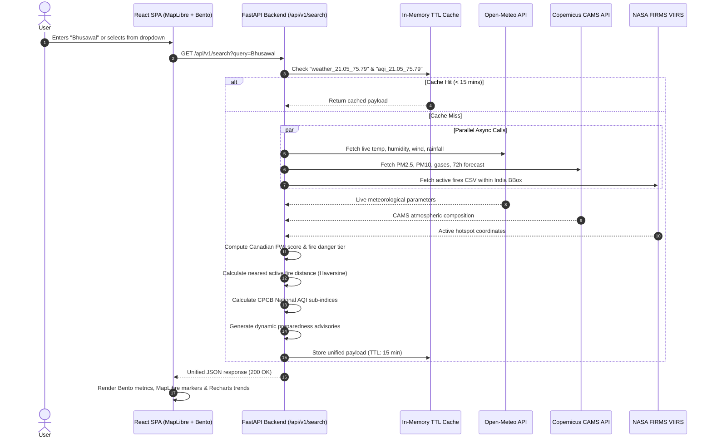

# System Architecture Specification

## AI-Driven Wildfire Risk Assessment & Air Quality Monitoring Platform (India)

---

## 1. System Topology & Component Boundaries

The platform operates as a decoupled client-server architecture consisting of an asynchronous Python backend microservice and a client-side vector-rendered single page application (SPA).

```mermaid
graph TD
    subgraph External Data Layer
        A1["NASA FIRMS API (VIIRS 375m)"]
        A2["Open-Meteo Weather API"]
        A3["Open-Meteo CAMS Air Quality API"]
    end

    subgraph Backend Microservice (FastAPI on Python 3.12)
        B1["FastAPI Ingestion & Routing Engine"]
        B2["In-Memory 15-min TTL Cache (cachetools)"]
        B3["Canadian FWI Scientific Engine"]
        B4["Geodesic Haversine Proximity Engine"]
        B5["CPCB NAQI Sub-Index Calculator"]
        B6["Dynamic Community Preparedness Engine"]
        B7[("Pre-bundled Indian Districts GeoJSON")]
    end

    subgraph Frontend Single Page Application (React 19 + Vite)
        C1["MapLibre GL JS (WebGL 60fps Vector Map)"]
        C2["Bento Grid Real-Time Dashboard"]
        C3["Recharts 72-Hour Atmospheric Trend Charts"]
        C4["Preparedness & Emergency Helpline Panel"]
    end

    A1 & A2 & A3 -->|Async Parallel Fetch| B1
    B1 <--> B2
    B1 --> B3 & B4 & B5 & B6
    B7 --> B1
    B1 -->|REST / JSON API| C1 & C2 & C3 & C4
```

---

## 2. Data Architecture & Flow Sequences

### Search Execution & Correlation Sequence



---

## 3. Mathematical & Algorithmic Pipelines

### 3.1 Canadian Forest Fire Weather Index (FWI) Engine
Operates strictly on four meteorological inputs:
1. **Fine Fuel Moisture Code (FFMC)**: Represents surface litter moisture content.
   $$m = \text{Equilibrium Moisture Content based on } T, RH, W, P$$
   $$FFMC = \frac{59.5 \times (250 - m)}{147.2 + m}$$
2. **Initial Spread Index (ISI)**: Incorporates wind velocity $W$ to model forward rate of fire spread:
   $$ISI = 0.208 \times e^{0.05039 \times W} \times f(FFMC)$$
3. **Build Up Index (BUI)**: Combines deeper duff and drought codes.
4. **Fire Weather Index (FWI)**: Final composite indicator of fire intensity:
   $$FWI = f(ISI, BUI)$$

### 3.2 Indian National AQI (NAQI) Calculation
For each pollutant $C$ (PM2.5, PM10), calculates the linear sub-index:
$$I = I_{low} + \frac{I_{high} - I_{low}}{C_{high} - C_{low}} \times (C - C_{low})$$
$$AQI = \max(I_{PM2.5}, I_{PM10})$$

---

## 4. State Management & Caching Topology

1. **Client-Side State**: React 19 local state + URL search parameters (`?query=Bhusawal`) allowing direct bookmarking and shareable links.
2. **Server-Side In-Memory Caching**: `cachetools.TTLCache` (maxsize=100, TTL=900s).
   - Guarantees repeated district queries return in **< 2ms** without external API round-trips.
   - Shields free-tier API quotas from exhaustion.
3. **Pre-bundled Centroids**: 39+ high-density Indian districts packaged in static JSON (`data/indian_districts.json`) eliminate database round-trips for location lookups.

---

## 5. Security, Secrets & Access Boundaries

1. **Environment Variables**: Managed via root `.env` and loaded defensively:
   - `NASA_FIRMS_MAP_KEY`
   - `PORT`
2. **CORS Boundary**: Enabled for all origins (`*`) during local development and restricted to the static site origin in production.
3. **Zero-Secret Client Contract**: No private tokens or cloud credentials ever enter the client-side JavaScript bundle.

---

## 6. Invariant Enforcement & Failure Recovery

| Potential Failure Mode | Root Cause | Automated Architectural Defense |
|---|---|---|
| **NASA FIRMS Timeout / 503** | Upstream NASA server maintenance. | Fallback to cached active fire list; graceful degradation to FWI weather assessment. |
| **Open-Meteo AQI Null Values** | Future forecast steps have null smoke values. | Defensive sanitization (`float(val) if val is not None else 0.0`) prevents parsing crashes. |
| **Server Sleep / Idle Spin-down** | Free hosting provider idle sleep. | On-demand architecture; no background cron workers required. Immediate wake on first request. |
| **Missing / Unknown District** | User enters obscure town name. | Fallback geocoding via Open-Meteo search API; defaults to nearest district centroid if unmatched. |

---

## 7. Deployment & Infrastructure Topology

- **Backend**: Containerized FastAPI service deployable to Render, Railway, or Fly.io with Docker or direct Python 3.12 runtime.
- **Frontend**: Static single-page application built with Vite (`dist/`), deployable to Vercel, Cloudflare Pages, or Netlify with universal SPA fallback rewrite (`/* -> /index.html`).
